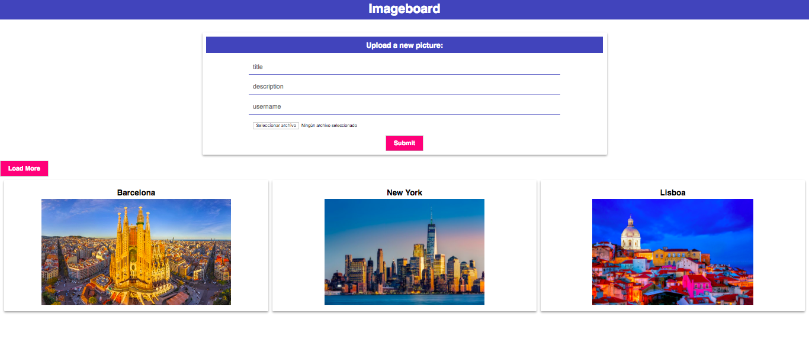
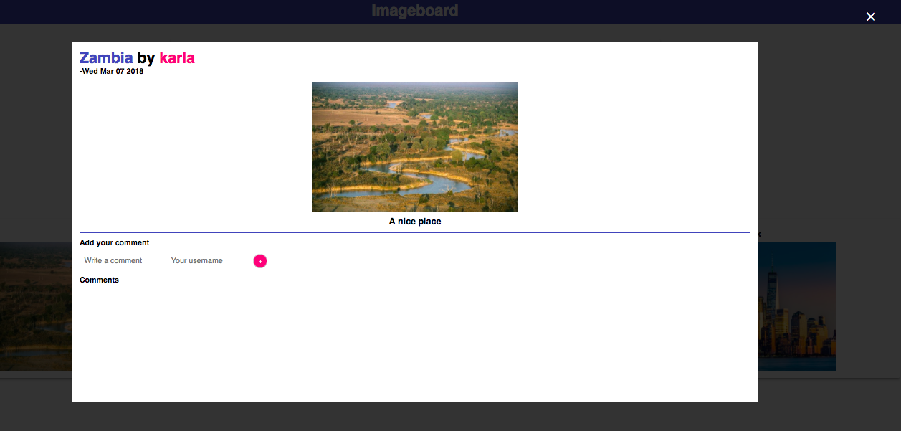
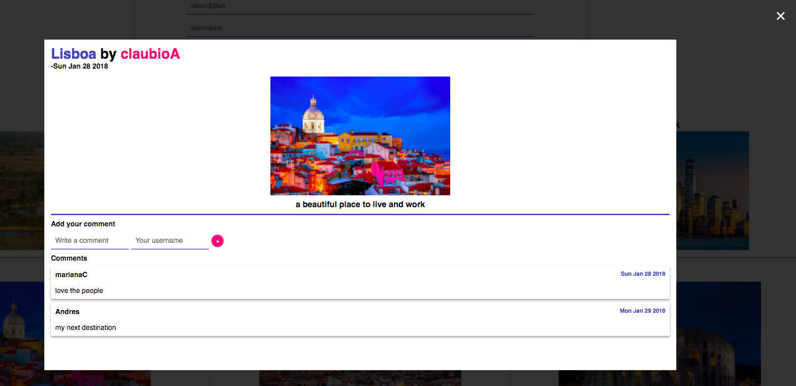
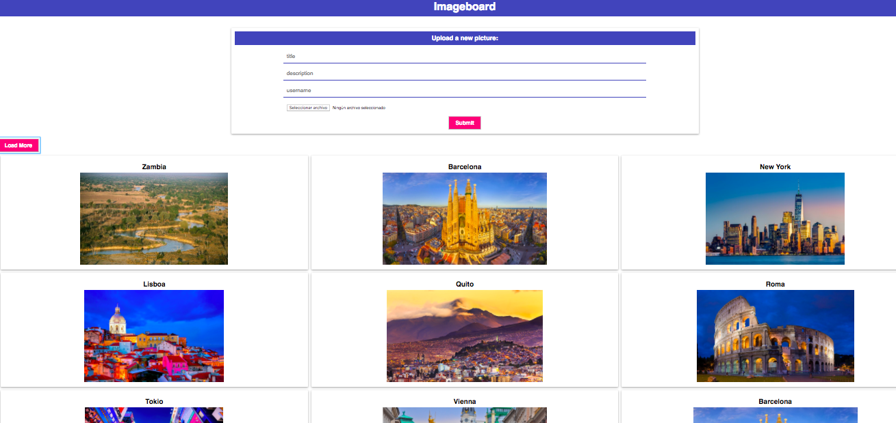

# Image Board Project:

A site where people can go and post an image of their choosing, along with a title and a textual description of that image,
and others could go and look at that image and make thoughtful remarks about it.

This is a single-page application made with Vue.js.

## Features:

1. 4 fields: image title, image description, username, a file input for the image itself and a submit button.

2. The use of Ajax to submit data.

3. The images are stored in S3.

4. There is a modal that shows the images in a larger size, we will also display the title of the image, the description of the image and the
name of the user that uploaded it. It will be shown also all the comments that have been made about the image.

### Images:

